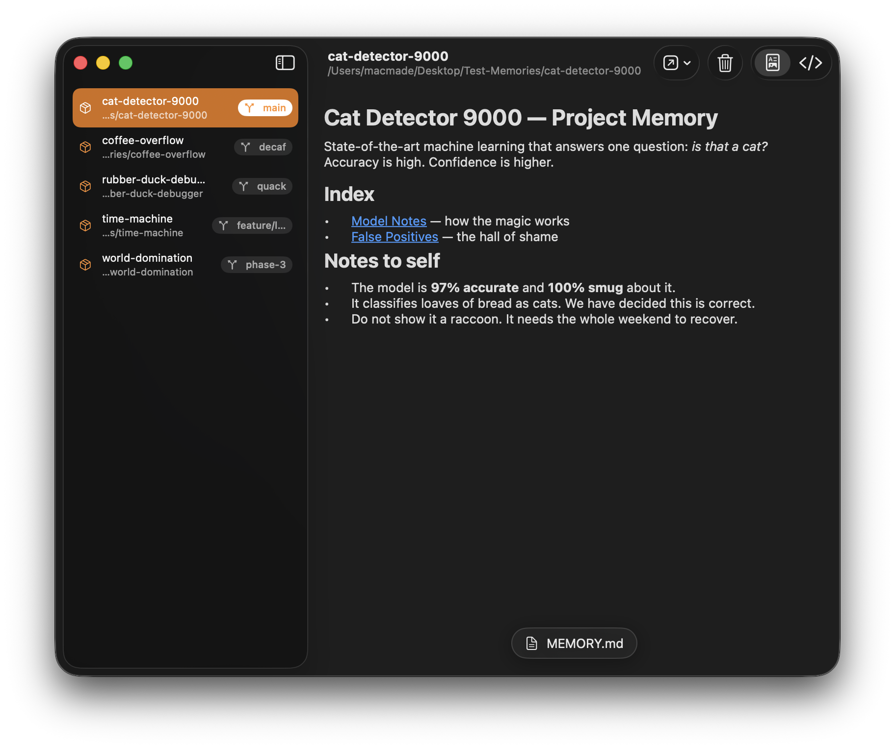

Memories
========

[](https://github.com/macmade/Memories/actions/workflows/ci-mac.yaml)
[](https://github.com/macmade/Memories/issues)

  
[](https://twitter.com/macmade)
[](https://github.com/sponsors/macmade)

### About

Memories is a macOS app for browsing and managing the memory files that
Claude Code keeps for your projects.

Claude Code stores per-project notes as Markdown files under `~/.claude`, which
are awkward to read directly from the filesystem. Memories lists them in one
window so you can review what's stored and remove what you no longer need.



### Features

- Lists all Claude Code projects that have stored memory, found automatically
  with no configuration. The list refreshes when the app becomes active.

- Shows the repository name and current branch for projects that are Git
  repositories, along with the full project path.

- Displays each memory file as rendered Markdown, with a toggle to view the raw
  source.

- Switches between a project's memory files from a floating menu. Links within a
  note open the referenced memory file; external links open in the browser.

- Opens a memory file in another application, or reveals the project folder in
  the Finder.

- Moves a single memory file, a project's whole memory folder, or a project's
  Claude folder to the Trash. The real project on disk is left untouched.

### Cloning

This project uses submodules.  
To clone it, use the following command:

```bash
git clone --recursive https://github.com/macmade/Memories.git
```

License
-------

Project is released under the terms of the MIT License.

Repository Infos
----------------

    Owner:          Jean-David Gadina - XS-Labs
    Web:            www.xs-labs.com
    Blog:           www.noxeos.com
    Twitter:        @macmade
    GitHub:         github.com/macmade
    LinkedIn:       ch.linkedin.com/in/macmade/
    StackOverflow:  stackoverflow.com/users/182676/macmade
